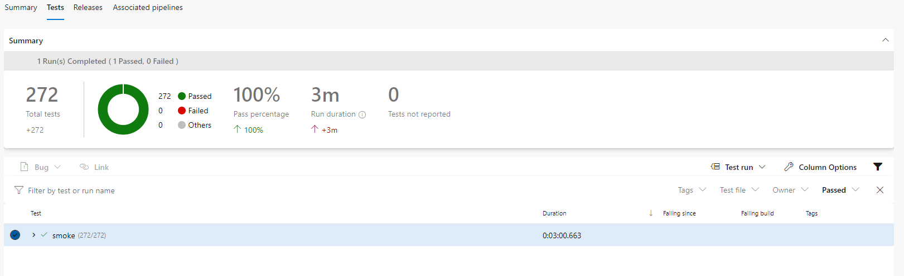

As many probably know or have heard, it is good to perform some type of automatic testing to check that important functions have not stopped working because of a recent change in the source code. There is a lack for this type of information on the internet so I thought I would simply contribute what I have learned.

## The goal

The goal of this post/tutorial is to develop a framework to make it relatively easy to build integrationtests and the source code will be available on [Github](https://github.com/loremipsumdonec/episerver-testframework).

In addition to building a test framework, I will also show an example of a Azure DevOps pipeline in to run the tests so that they become part of the release flow.

> This is an example of a real project that I'm currently working with, it has a total of 534 tests, but because of a “bug” it only shows 272 tests in Azure DevOps.