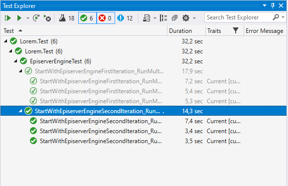
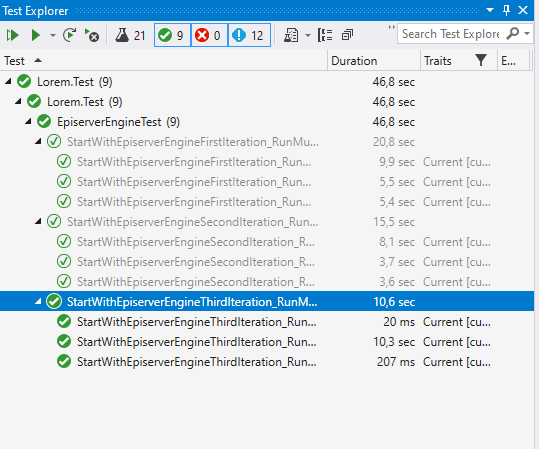
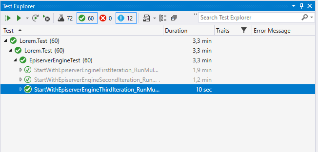

## What are the options?

Like everything else there are several ways to solve a problem. What we know is that we do not want start up Episerver in every test case. 

But this will block us from throw away the database before every test case. So we need some way to restore the database to the orginal state in some way.

## Restore with a backup

The first option is to simply take a backup and then use it to restore the database between test cases.  To take a backup of a database is quite simple, see the SQL below. 

```sql
BACKUP DATABASE [{databaseName}] 
TO DISK = N'{pathToBackupFile}' 
WITH NOFORMAT, NOINIT,  NAME = N'{databaseName}', SKIP, NOREWIND, NOUNLOAD,  STATS = 10
```

Then to restore the database we can use the following SQL.

```sql
ALTER DATABASE [{databaseName}] SET SINGLE_USER WITH ROLLBACK IMMEDIATE;
RESTORE DATABASE[{databaseName}] FROM  DISK = N'{pathToBackupFile}' WITH  FILE = 1, NOUNLOAD, REPLACE, STATS = 5
ALTER DATABASE [{databaseName}] SET MULTI_USER;
```

If we try this directly in _Microsoft SQL Server Mangement Studio_ we can see that it also goes fast.

```sql
RESTORE DATABASE successfully processed 1131 pages in 0.123 seconds (71.836 MB/sec).
```

### Second iteration of the service

With the above information we can continue and create a second iteration of the service that will take a backup of the database and restore it before every test case. The service also needs to be a [singletone](https://www.geeksforgeeks.org/singleton-design-pattern/) so that it is available throughout the test session.

> I will not go into detail in this implementation, it is easier if you simply check the source code yourself, [EpiserverEngineSecondIteration.cs](https://github.com/loremipsumdonec/episerver-testframework/blob/main/Lorem.Test/Services/EpiserverEngineSecondIteration.cs). 

If we create a new test case with the latest iteration of the service, we can then compare the results with previous test case.

```csharp
[Theory]
[InlineData(1)]
[InlineData(2)]
[InlineData(3)]
public void StartWithEpiserverEngineSecondIteration_RunMultipleTimesNoUser_SinglePageExists(int notUsed)
{
    var engine = EpiserverEngineSecondIteration.GetInstance();
    engine.Start();

    IContentRepository repository = ServiceLocator.Current.GetInstance<IContentRepository>();

    var startPage = repository.GetDefault<StartPage>(ContentReference.RootPage);

    startPage.Name = "Start";
    startPage.Heading = "Welcome to Lorem";
    startPage.StartPublish = DateTime.Now;

    repository.Save(startPage, SaveAction.Publish, AccessLevel.NoAccess);

    var pages = repository.GetChildren<StartPage>(ContentReference.RootPage);
    Assert.Single(pages);
}
```

When we run the test case, it does not make a huge difference in time, it is faster but not much. We may get an average of 4-5 seconds per test case.




The reason why it takes several seconds to run the reset is because when you set the database _singel user mode_ there are some active transactions that must be discarded and this is what takes time.

```sql
Nonqualified transactions are being rolled back. Estimated rollback completion: 0%.
Nonqualified transactions are being rolled back. Estimated rollback completion: 100%.
```

This will not really work well enough so we need to look at other options.

## Delete the content created

When working with Episerver, you mainly handle some type of content: _page_, _block_ or _media_. So we can then use `IContentRepository` before each test case and force delete all content. If we look a little deeper into how Episerver stores data, we see that it is in a tree structure where everything has (usually) a parent. Everything is then connected to a root node.

So by getting everything that is under root, we should be able to get all content and delete it.

```csharp
private void ClearContents()
{
    var repository = ServiceLocator.Current.GetInstance<IContentRepository>();

    foreach (var content in repository.GetChildren<IContent>(ContentReference.RootPage))
    {
    	repository.Delete(content.ContentLink, true, AccessLevel.NoAccess);
	}	
}
```

There are also other important things that cannot be deleted, such as the recycle bin. If you happen to delete these, you will not be able to start up Episerver. So we need a way to exclude these. Now in the beginning, we can naively exclude the content by name.

```csharp
private void ClearContents()
{
    var repository = ServiceLocator.Current.GetInstance<IContentRepository>();

    var ignoreNames = new List<string>() {
        "Root",
        "Recycle Bin",
        "SysGlobalAssets",
        "SysContentAssets"
    };
    
    foreach (var content in repository.GetChildren<IContent>(ContentReference.RootPage))
    {
        if(ignoreNames.Contains(content.Name))
        {
            continue;
        }
        
    	repository.Delete(content.ContentLink, true, AccessLevel.NoAccess);
	}	
}
```

### Third iteration of the service

It's time to build a third iteration of the service where we focus on deleting the content in Episerver. The complete code for this service is available in the file [EpiserverEngineThirdIteration.cs](https://github.com/loremipsumdonec/episerver-testframework/blob/main/Lorem.Test/Services/EpiserverEngineThirdIteration.cs). We can the create a new test case with the third iteration of the service.

```csharp
[Theory]
[InlineData(1)]
[InlineData(2)]
[InlineData(3)]
public void StartWithEpiserverEngineThirdIteration_RunMultipleTimesNoUser_SinglePageExists(int notUsed)
{
    var engine = EpiserverEngineThirdIteration.GetInstance();
    engine.Start();

    IContentRepository repository = ServiceLocator.Current.GetInstance<IContentRepository>();

    var startPage = repository.GetDefault<StartPage>(ContentReference.RootPage);

    startPage.Name = "Start";
    startPage.Heading = "Welcome to Lorem";
    startPage.StartPublish = DateTime.Now;

    repository.Save(startPage, SaveAction.Publish, AccessLevel.NoAccess);

    var pages = repository.GetChildren<StartPage>(ContentReference.RootPage);
    Assert.Single(pages);
}
```

The test case is faster than the previous by 4-5 seconds and it differs around 8-10 seconds from the test case with the first iteration of the service. It may not look like much. But if we look a little closer, we see that it is one test that takes 10 seconds and the remaining two runs faster.

> There will always be a test case that gets the cost of starting up Episerver and this takes around 10 - 20 seconds depending on the scale of the project.




If we run each test case several times, the time difference becomes clearer. Below is an image where test cases have been run 20 times. There we see that there is no major difference between the first and second iteration of the service. While the third iteration is much faster.



## With a user

We have now solved the first problem with speed, but we have not directly dealt with the problem of creating a user. But since we no longer throw away the database before each test case, this is no longer a problem.

## Conclusion

We have now solved both problems and have a reasonably good foundation to be able to build on. In the next chapter, we will start looking at how to create test cases so that these will be a little easier to understand and work with.

