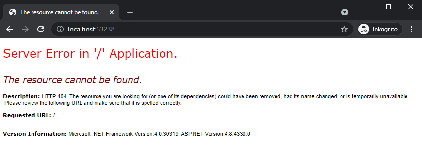
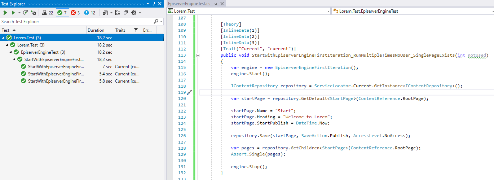

---

url: "/episerver/create-a-test-framework/part-3/"
date: "2021-07-27"
book: "/episerver/create-a-test-framework/"
type: "chapter"

title: "Create a Episerver service"
preamble: "In the previous chapter we successfully started Episerver in the test project, but that code was not resuable. We need to break out the code into a service of some sort so that we can call it from our test cases."
---

## First iteration of the service

The first step is that we move the code from the previous chapter into a separate class, let's call it `EpiserverEngineFirstIteration`. Here we add two methods `Start` and `Stop` to handle Episerver, the complete code is in the file [EpiserverEngineFirstIteration.cs](https://github.com/loremipsumdonec/episerver-testframework/blob/main/Lorem.Test/Services/EpiserverEngineFirstIteration.cs). 

```csharp
public class EpiserverEngineFirstIteration
{
    private InitializationEngine _engine;

    public void Start()
    {
        string webConfig = GetWebConfig();
        LoadConfigurationSource(webConfig);
        LoadHostingEnvironment(webConfig);
        CreateDatabase();

        List<IInitializableModule> modules = null;
        var assemblies = new AssemblyList(true).AllowedAssemblies;

        _engine = new InitializationEngine(modules, HostType.TestFramework, assemblies);
        _engine.Initialize();
    }

    public void Stop()
    {
        _engine.Uninitialize();
    }

    ...
}
```
Now that we have moved the code to a seperate class. Let’s recreate the test case from the previous chapter. 

```csharp
[Fact]
public void StartWithEpiserverEngineFirstIteration_IContentRepositoryIsNotNull()
{
    var engine = new EpiserverEngineFirstIteration();
    engine.Start();

    IContentRepository repository = ServiceLocator.Current.GetInstance<IContentRepository>();
    Assert.NotNull(repository);

    engine.Stop();
}
```

> This is a little cleaner than the test case from the previous chapter

## Let's create some content

Now that we have the service `EpiserverEngineFirstIteration`, we can go ahead and creating some content. Once we have called `engine.Start()`, we can use the same API that we would use in a normal web application with Episerver. For example, use `IContentRepository` to create and save a new page.

The test case below adds a new `StartPage` named _Start_ and a heading _Welcome to Lorem_.

```csharp
[Fact]
public void StartWithEpiserverEngineFirstIteration_CreateStartPage_SinglePageExists()
{
    var engine = new EpiserverEngineFirstIteration();
    engine.Start();

    IContentRepository repository = ServiceLocator.Current.GetInstance<IContentRepository>();

    var startPage = repository.GetDefault<StartPage>(ContentReference.RootPage);

    startPage.Name = "Start";
    startPage.Heading = "Welcome to Lorem";
    startPage.StartPublish = DateTime.Now;

    repository.Save(startPage, SaveAction.Publish, AccessLevel.NoAccess);

    var pages = repository.GetChildren<StartPage>(ContentReference.RootPage);
    Assert.Single(pages);

    engine.Stop();
}
```

### Verify that there really is content in Episerver

If we start the web application and visit the website, after we have run the above test case, we will receive a HTTP 404 Not found message, which is because there is no configured website.



If we continue to http://localhost:63238/Episerver we will notice that we do not have any users to log in with.


Episerver is set to use _ASP.NET Identity_ and not _ASP.NET Membership_, so there is no connection with _WindowsMembershipProvider_. As the test project creates a new database at each test session, we will need a function to also set up a user every time.

## Create a user

I will not describe in detail how to set up a new user with `EPiServer.Cms.UI.AspNetIdentity` you can instead take a look at the method `CreateUser` in the file [EpiserverEngineTest.cs](https://github.com/loremipsumdonec/episerver-testframework/blob/main/Lorem.Test/EpiserverEngineTest.cs). 

When we use the `CreateUser` method, we will also be able to log in to Episerver Administration interface and check that we have really created a `StartPage`.

```csharp
[Fact]
public void StartWithEpiserverEngineFirstIteration_CreateStartPage_SinglePageExists()
{
    var engine = new EpiserverEngineFirstIteration();
    engine.Start();

    CreateUser("Administrator", "Administrator", "loremipsumdonec@supersecretpassword.io");
    
    IContentRepository repository = ServiceLocator.Current.GetInstance<IContentRepository>();

    var startPage = repository.GetDefault<StartPage>(ContentReference.RootPage);

    startPage.Name = "Start";
    startPage.Heading = "Welcome to Lorem";
    startPage.StartPublish = DateTime.Now;

    repository.Save(startPage, SaveAction.Publish, AccessLevel.NoAccess);

    var pages = repository.GetChildren<StartPage>(ContentReference.RootPage);
    Assert.Single(pages);

    engine.Stop();
}

private void CreateUser(string username, string password, string email)
{
    ...
}

```
> The test case will create an administrator user with username Administrator and password Administrator


## A major problem

It may seem that everything works correctly and that we have a foundation that may work to continue with. But when you start running multiple test cases in a row you will encounter a problem.

```csharp
[Theory]
[InlineData(1)]
[InlineData(2)]
[InlineData(3)]
public void StartWithEpiserverEngineFirstIteration_RunMultipleTimes_SinglePageExists(int notUsed)
{
    var engine = new EpiserverEngineFirstIteration();
    engine.Start();

    CreateUser("Administrator", "Administrator", "loremipsumdonec@supersecretpassword.io");

    IContentRepository repository = ServiceLocator.Current.GetInstance<IContentRepository>();

    var startPage = repository.GetDefault<StartPage>(ContentReference.RootPage);

    startPage.Name = "Start";
    startPage.Heading = "Welcome to Lorem";
    startPage.StartPublish = DateTime.Now;

    repository.Save(startPage, SaveAction.Publish, AccessLevel.NoAccess);

    var pages = repository.GetChildren<StartPage>(ContentReference.RootPage);
    Assert.Single(pages);

    engine.Stop();
}
```

The above example runs the same test case 3 times and only the first run will succeed while the rest will fail the following exception.

```text
System.Data.Entity.Core.EntityCommandExecutionException : An error occurred while executing the command definition. See the inner exception for details. ---- System.Data.SqlClient.SqlException : Invalid object name 'dbo.AspNetUsers'.
```

I can not explain exactly why this happens but my guess is that `Microsoft.AspNet.Identity` is not affected when the test case shuts down Episerver.  When the test case is runs again, the database is deleted and rebuilt. But from the `Microsoft.AspNet.Identity` perspective, the database still exists and thus does not need to be recreated.

This can also be seen as a major problem and that prevents us from using the test project.

## But before we give up

For now, we can go around the problem and dont create a user. What will happen when we run the same test case multiple times in a test session?

```csharp
[Theory]
[InlineData(1)]
[InlineData(2)]
[InlineData(3)]
public void StartWithEpiserverEngineFirstIteration_RunMultipleTimesNoUser_SinglePageExists(int notUsed)
{
    var engine = new EpiserverEngineFirstIteration();
    engine.Start();

    IContentRepository repository = ServiceLocator.Current.GetInstance<IContentRepository>();

    var startPage = repository.GetDefault<StartPage>(ContentReference.RootPage);

    startPage.Name = "Start";
    startPage.Heading = "Welcome to Lorem";
    startPage.StartPublish = DateTime.Now;

    repository.Save(startPage, SaveAction.Publish, AccessLevel.NoAccess);

    var pages = repository.GetChildren<StartPage>(ContentReference.RootPage);
    Assert.Single(pages);

    engine.Stop();
}
```

As you can see from the picture below, it takes around 18 seconds to run the test 3 times. Here it becomes clear that it takes time to run this type of test. 

If we do a rough calculation and estimate that it takes on average 6 seconds to run a test case, then it will take around a total of 600 seconds (5 minutes) to run 100 test cases. That’s a long time. We will need to do something about this.



## Conclusion

In this chapter, we have made a rough implementation of the service to manage Episerver. We have encountered two problems where one is that you cannot create a user multiple times in the same test session and the other is the time it takes to run test cases.

In the next chapter, we will move on to fixing both problems.

