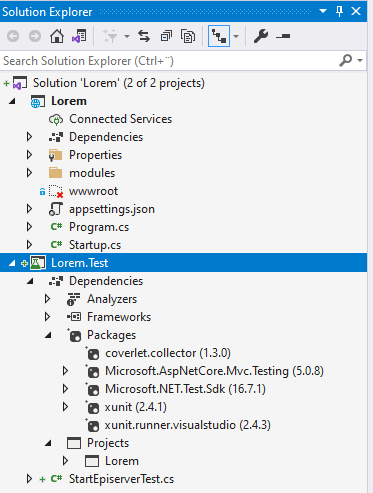
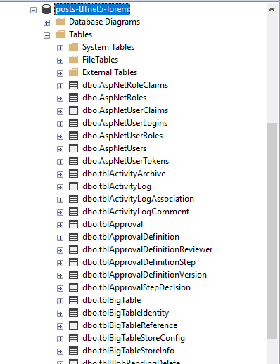
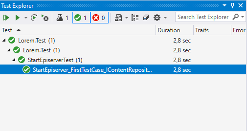

## Getting Started

To get started with integration testing, you can start by setting up a new Optimizely CMS 12 project using the information available [here]( https://github.com/episerver/netcore-preview). Then create a test project that for example uses [xUnit](https://xunit.net/), you will also need to add the nuget [Microsoft.AspNetCore.Mvc.Testing](https://www.nuget.org/packages/Microsoft.AspNetCore.Mvc.Testing).

> Don´t forget to create a database and update the connectionstring in the _appsettings.json_ or _appsettings.Development.json_

An example of a solution that contains an empty Optimizely CMS 12 with an associated test project, you can find the complete project [here](https://github.com/loremipsumdonec/episerver-testframework/tree/main/posts/test_framework_for_net5/example).



If you start the web project, you will get a _404 error_, which is not strange as there is no content, but if you look in the database, all tables and views will be there.

> Optimizely CMS 12 will automatically create and update the tables in the database, in version 11 and older this was handled with configuration in web.config.



## Let's start

Now it's time to add the first test case where we are testing to start Optimizely CMS. We will need to use the [WebApplicationFactory<TEntryPoint>](https://docs.microsoft.com/en-us/dotnet/api/microsoft.aspnetcore.mvc.testing.webapplicationfactory-1?view=aspnetcore-5.0) class and use `Startup` from the web project as the entry point, you can find the code in the file [StartEpiserverTest.cs](https://github.com/loremipsumdonec/episerver-testframework/blob/main/posts/test_framework_for_net5/example/Lorem.Test/StartEpiserverTest.cs)

```csharp
[Fact]
public void StartEpiserver_FirstTestCase_IContentRepositoryIsNotNull()
{
    var factory = new WebApplicationFactory<Startup>();

    IContentRepository repository = factory.Services.GetInstance<IContentRepository>();
    Assert.NotNull(repository);
}
```

If we run the above test case, we will get the following error message.

```bash
System.InvalidOperationException : No method 'public static IHostBuilder CreateHostBuilder(string[] args)' or 'public static IWebHostBuilder CreateWebHostBuilder(string[] args)' found on 'Lorem.Program'. Alternatively, WebApplicationFactory`1 can be extended and 'CreateHostBuilder' or 'CreateWebHostBuilder' can be overridden to provide your own instance.
```

Which is because `WebApplicationFactory<TEntryPoint>` by [default](https://docs.microsoft.com/en-us/dotnet/api/microsoft.aspnetcore.mvc.testing.webapplicationfactory-1.createhostbuilder?view=aspnetcore-5.0#remarks) tries to find `public static IHostBuilder CreateHostBuilder(string[] args)` in the same assembly as the `Startup` class. 

> Optimizly should consider remove the parameter `isDevelopment` so method `CreateHostBuilder` has the "default" signature.

```csharp
public static IHostBuilder CreateHostBuilder(string[] args, bool isDevelopment)
{
    if (isDevelopment)
    {
        //Development configuration can be addded here, like local logging.
        return Host.CreateDefaultBuilder(args)
            .ConfigureCmsDefaults()
            .ConfigureWebHostDefaults(webBuilder =>
			{
				webBuilder.UseStartup<Startup>();
			});
    }
    else
    {
        return Host.CreateDefaultBuilder(args)
            .ConfigureCmsDefaults()
            .ConfigureWebHostDefaults(webBuilder => 
			{
				webBuilder.UseStartup<Startup>();
			});
    }
}
```

To solve this we have to remove the `isDevelopment` parameter and change to the following method signature.

```csharp
public static IHostBuilder CreateHostBuilder(string[] args)
{
    return Host.CreateDefaultBuilder(args)
        .ConfigureCmsDefaults()
        .ConfigureWebHostDefaults(webBuilder =>
        {
            webBuilder.UseStartup<Startup>();
        });
}
```

You can find the complete code for the change in the [Program.cs](https://github.com/loremipsumdonec/episerver-testframework/blob/main/posts/test_framework_for_net5/example/Lorem/Program.cs#L13) file and if we try to run the test case again it will work.



## Conclusion

Now we have created a project with an associated test project, and started the public preview of Optimizely CMS 12.
