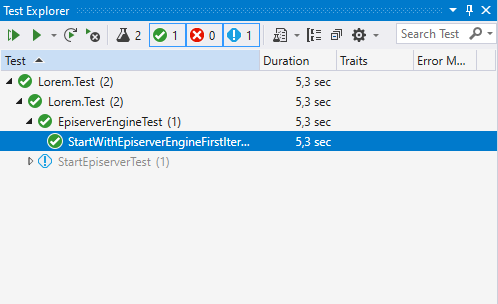
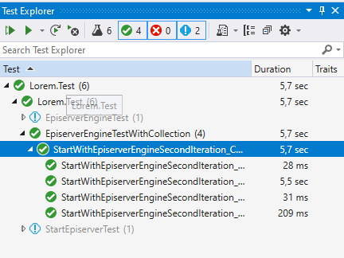

To start Optimizely CMS 12, we used `WebApplicationFactory<TEntryPoint>` and this class is a good base that we can extend on to get a service that has the responsibility to manage Optimizely CMS 12.

## First iteration

The first iteration of the service could be called `EpiserverEngineFirstIteration<TEntryPoint>` and lets it inherit from `WebApplicationFactory<TEntryPoint>`. We can then move the code from the previous test case into a `Start` method.

```csharp
public class EpiserverEngineFirstIteration<TEntryPoint>
    : WebApplicationFactory<TEntryPoint> where TEntryPoint : class
{
	private bool _started;

 	public void Start()
	{
		if(_started)
        {
            return;
        }

        var repository = Services.GetInstance(typeof(IContentRepository));
        
        if (repository == null)
        {
            throw new InvalidOperationException("Failed starting");
        }

        _started = true;
    }
}
```

## Create the database

An important function is that each new test session should create a new empty database, and good place to add this is in the `Start` method, you can find the complete code in [EpiserverEngineFirstIteration.cs](https://github.com/loremipsumdonec/episerver-testframework/tree/main/posts/test_framework_for_net5/example/Lorem.Test/Services/EpiserverEngineFirstIteration.cs) file.

```csharp
public class EpiserverEngineFirstIteration<TEntryPoint>
    : WebApplicationFactory<TEntryPoint> where TEntryPoint : class
{
	private bool _started;

 	public void Start()
	{
		if(_started)
        {
            return;
        }

        CreateCmsDatabase();
        
        var repository = Services.GetInstance(typeof(IContentRepository));
        
        if (repository == null)
        {
            throw new InvalidOperationException("Failed starting");
        }

        _started = true;
    }
        
    private void CreateCmsDatabase() 
    {
        ...
    }
}
```

## Create a test case

To test `EpiserverEngineFirstIteration<TEntryPoint>`, create a new test case that that creates a page. You can find the test in [EpiserverEngineTest.cs](https://github.com/loremipsumdonec/episerver-testframework/tree/main/posts/test_framework_for_net5/example/Lorem.Test/EpiserverEngineTest.cs) and if you run the test it should succeed. 

> The test case also creates a user that makes it possible to launch the web application and log in to verify that it exists.

```csharp
[Fact]
public async void StartWithEpiserverEngineFirstIteration_CreateStartPage_HasPage()
{
    EpiserverEngineFirstIteration<Startup> engine = new();
    engine.Start();

    await CreateUser("Administrator", "Administrator123#", "loremipsumdonec@supersecretpassword.io", Roles.Administrators);

    IContentRepository repository = ServiceLocator.Current.GetInstance<IContentRepository>();

    var startPage = repository.GetDefault<StartPage>(ContentReference.RootPage);

    startPage.Name = "Start";
    startPage.Heading = "Welcome to Lorem";
    startPage.StartPublish = DateTime.Now;

    repository.Save(startPage, SaveAction.Publish, AccessLevel.NoAccess);

    var pages = repository.GetChildren<StartPage>(ContentReference.RootPage);
    Assert.Single(pages);
}
```



## Run multiple test cases

To be able to run several test cases in a row and have a relatively good speed of the test cases, we should only start Optimizely CMS once during each test session, this is the same as older versions of Optimizely CMS. This means that we need to restore the database by deleting content.

> There is also another type of data that is not content and needs to be deleted between test cases. This is out of scope for this introduction, instead look in the file [CmsTestFramework.cs](https://github.com/loremipsumdonec/episerver-testframework/blob/main/src/net5.0/Lorem.Testing.Optimizely.CMS/TestFrameworks/CmsTestFramework.cs#L35) for a examples.

To keep the same instance running throughout the test session you can use [Shared Context between tests.](https://xunit.net/docs/shared-context) The following example uses `EpiserverEngineSencodIteration<TEntryPoint>` which deletes available content, check the file [EpiserverEngineSecondIteration.cs](https://github.com/loremipsumdonec/episerver-testframework/blob/main/posts/test_framework_for_net5/example/Lorem.Test/Services/EpiserverEngineSecondIteration.cs)

```csharp
[CollectionDefinition("Default")]
public class EpiserverEngineCollectionFixture
	: ICollectionFixture<EpiserverEngineSecondIteration<Startup>>
{
}

[Collection("Default")]
public class EpiserverEngineTestWithCollection
{
	private EpiserverEngineSecondIteration<Startup> _engine;

    public EpiserverEngineTestWithCollection(EpiserverEngineSecondIteration<Startup> engine) 
    {
        _engine = engine;
        _engine.Start();
    }
    
    [Theory]
    [InlineData(1)]
    [InlineData(2)]
    [InlineData(3)]
    [InlineData(4)]
    public async void StartWithEpiserverEngineSecondIteration_CreateStartPage_HasPage(int _)
    {
    	await CreateUser(...);

		IContentRepository repository = ServiceLocator.Current.GetInstance<IContentRepository>();

        var startPage = repository.GetDefault<StartPage>(ContentReference.RootPage);

        startPage.Name = "Start";
        startPage.Heading = "Welcome to Lorem";
        startPage.StartPublish = DateTime.Now;

        repository.Save(startPage, SaveAction.Publish, AccessLevel.NoAccess);

        var pages = repository.GetChildren<StartPage>(ContentReference.RootPage);
        Assert.Single(pages);
	}
}
```



## Conclusion

Now we have gone through some of the steps to start up the public preview of Optimizely CMS 12, and it is much easier and better than before.

Another advantage is that there is also no major difference in the API from Optimizely CMS 11 in .NET framework. Which means that it will be relatively easy to migrate your test cases from CMS 11 to CMS 12. Of course, some adjustments will be required, but it feels like it will be manageable.
